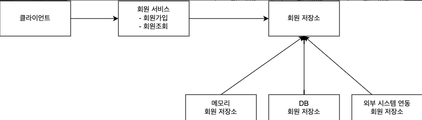
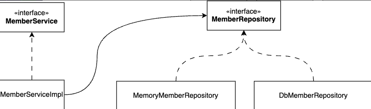
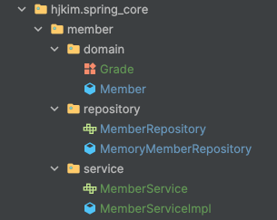

# Spring Core Project

## Intro
- Java 21, Spring 3.2.3
### 목적
Dependency 가 존재하지 않는 Spring을 통해 객체지향의 이해 및 Spring 전반적인 핵심 내용을 이해
### 비즈니스 요구사항과 설계
#### 회원 도메인 설계
- 회원 도메인 협력 관계
  - 
- 회원 클래스 다이어그램
  - 
- 회원 객체 다이어그램
  - 
#### 실제 설계


- `domain` : `Member DTO` 객체와 회원 등급을 가리키는 `Enum Class Grade`
- `repository` : 다형성을 위한 `MemberRpository interface` 와 기능 구현을 위한 `MemoryMemberRepository`
- `service` : 다형성을 위한 `MemberService interface` 와 기능 구현을 위한 `MemberServiceImpl`
    - `MemberServiceImpl` 에서 회원가입와 회원조회를 위해 `MemberRepository`를 사용해야 한다.
      ```java
      private final MemberRepository memberRepository = new MemoryMemberRepository();
      ```