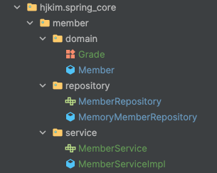

# Spring Core Project

## Intro
- Java 21, Spring 3.2.3
### 목적
Dependency 가 존재하지 않는 Spring을 통해 객체지향의 이해 및 Spring 전반적인 핵심 내용을 이해

### 회원 도메인 설계

<details>
    <summary>회원 도메인 다이어그램 설계</summary>

- 회원 도메인 협력 관계
    - 
- 회원 클래스 다이어그램
    - 
- 회원 객체 다이어그램
    - 
</details>

<details>
    <summary>회원 도메인 로직 설계</summary>



- `domain` : `Member DTO` 객체와 회원 등급을 가리키는 `Enum Class Grade`
- `repository` : 다형성을 위한 `MemberRpository interface` 와 기능 구현을 위한 `MemoryMemberRepository`
- `service` : 다형성을 위한 `MemberService interface` 와 기능 구현을 위한 `MemberServiceImpl`
    - `MemberServiceImpl` 에서 회원가입와 회원조회를 위해 `MemberRepository`를 사용해야 한다.
      ```java
      private final MemberRepository memberRepository = new MemoryMemberRepository();
      ```
</details>

#### 회원 도메인 설계의 문제점
- 다른 저장소를 변경할 때 OCP원칙을 준수할까?
- DIP또한 지키고 있을까?
    - [추상화에도 의존하고 구체화에도 의존한다.](./src/main/java/hjkim/spring_core/member/service/MemberServiceImpl.java)
    ```Java
    private final MemberRepository memberRepository = new MemoryMemberRepository();
    ```
---

### 주문과 할인 도메인 설계